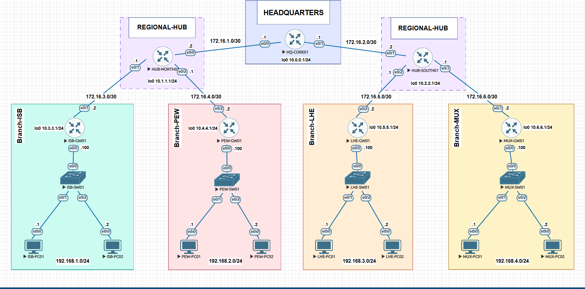
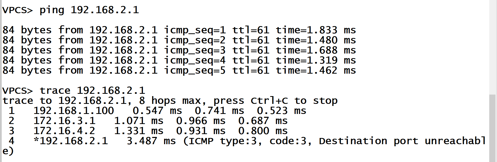
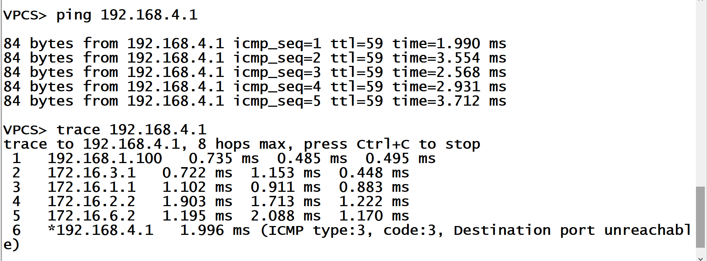
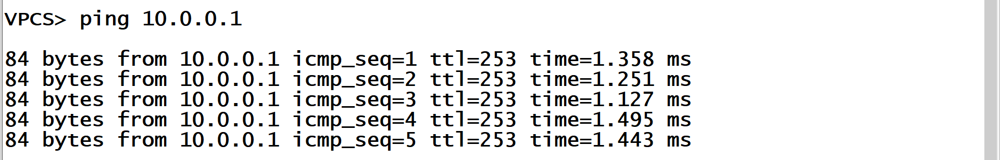

# Cisco IOS Default Routing Lab 2: 3-Tier Enterprise Network

This lab demonstrates how to configure **Default Routing** and **Static Routing** across a 3-tier corporate enterprise network. The setup connects four branch offices (**Islamabad**, **Peshawar**, **Lahore**, and **Multan**) through two regional hubs (**HUB-NORTH01** and **HUB-SOUTH01**), which connect to a central headquarters router (**HQ-CORE01**).

The main goal of this project is to create an efficient and scalable routing design. Instead of manually adding every single remote network to the branch routers, each branch router uses a single **default route** (`0.0.0.0 0.0.0.0`) pointing to its regional hub. The regional hubs and the central HQ core router then use precise **static routes** to direct traffic to the correct destination.

---

## Network Topology

### Topology Overview
* **7 Routers:** 1 Central Core Router (`HQ-CORE01`), 2 Regional Hub Routers (`HUB-NORTH01`, `HUB-SOUTH01`), and 4 Branch Gateways (`ISB-GW01`, `PEW-GW01`, `LHE-GW01`, `MUX-GW01`)
* **4 Switches:** Layer 2 access switches (`ISB-SW01`, `PEW-SW01`, `LHE-SW01`, `MUX-SW01`)
* **8 Host PCs:** 2 PCs per branch network (`PC01` and `PC02`)
* **6 WAN Links:** `/30` point-to-point connections between Core-to-Hub and Hub-to-Branch routers
* **4 Branch LANs:** `/24` subnets for host computers
* **7 Loopback Interfaces:** `/24` subnets simulating internal router management networks

---

## IP Addressing Tables

### 1. WAN Links (Router-to-Router /30 Subnets)

| Link Subnet | Device A | Device A IP | Device B | Device B IP |
| :--- | :--- | :--- | :--- | :--- |
| `172.16.1.0/30` | HQ-CORE01 (e0/0) | 172.16.1.1 | HUB-NORTH01 (e0/0) | 172.16.1.2 |
| `172.16.2.0/30` | HQ-CORE01 (e0/1) | 172.16.2.1 | HUB-SOUTH01 (e0/1) | 172.16.2.2 |
| `172.16.3.0/30` | HUB-NORTH01 (e0/1) | 172.16.3.1 | ISB-GW01 (e0/1) | 172.16.3.2 |
| `172.16.4.0/30` | HUB-NORTH01 (e0/2) | 172.16.4.1 | PEW-GW01 (e0/2) | 172.16.4.2 |
| `172.16.5.0/30` | HUB-SOUTH01 (e0/2) | 172.16.5.1 | LHE-GW01 (e0/2) | 172.16.5.2 |
| `172.16.6.0/30` | HUB-SOUTH01 (e0/3) | 172.16.6.1 | MUX-GW01 (e0/3) | 172.16.6.2 |

### 2. Branch LAN Networks (/24 Subnets)

| Host Device | Branch Location | Host Interface | Host IP | Gateway IP (Interface) | Subnet |
| :--- | :--- | :--- | :--- | :--- | :--- |
| **ISB-PC01** | Islamabad | eth0 | 192.168.1.1 | 192.168.1.100 (e0/0) | `192.168.1.0/24` |
| **ISB-PC02** | Islamabad | eth0 | 192.168.1.2 | 192.168.1.100 (e0/0) | `192.168.1.0/24` |
| **PEW-PC01** | Peshawar | eth0 | 192.168.2.1 | 192.168.2.100 (e0/0) | `192.168.2.0/24` |
| **PEW-PC02** | Peshawar | eth0 | 192.168.2.2 | 192.168.2.100 (e0/0) | `192.168.2.0/24` |
| **LHE-PC01** | Lahore | eth0 | 192.168.3.1 | 192.168.3.100 (e0/0) | `192.168.3.0/24` |
| **LHE-PC02** | Lahore | eth0 | 192.168.3.2 | 192.168.3.100 (e0/0) | `192.168.3.0/24` |
| **MUX-PC01** | Multan | eth0 | 192.168.4.1 | 192.168.4.100 (e0/0) | `192.168.4.0/24` |
| **MUX-PC02** | Multan | eth0 | 192.168.4.2 | 192.168.4.100 (e0/0) | `192.168.4.0/24` |

### 3. Router Loopback Interfaces (/24 Subnets)

| Device | Interface | IP Address & Mask | Description |
| :--- | :--- | :--- | :--- |
| **HQ-CORE01** | Loopback0 | `10.0.0.1 255.255.255.0` | Central HQ Loopback Subnet |
| **HUB-NORTH01** | Loopback0 | `10.1.1.1 255.255.255.0` | North Regional Hub Loopback Subnet |
| **HUB-SOUTH01** | Loopback0 | `10.2.2.1 255.255.255.0` | South Regional Hub Loopback Subnet |
| **ISB-GW01** | Loopback0 | `10.3.3.1 255.255.255.0` | Islamabad Branch Loopback Subnet |
| **PEW-GW01** | Loopback0 | `10.4.4.1 255.255.255.0` | Peshawar Branch Loopback Subnet |
| **LHE-GW01** | Loopback0 | `10.5.5.1 255.255.255.0` | Lahore Branch Loopback Subnet |
| **MUX-GW01** | Loopback0 | `10.6.6.1 255.255.255.0` | Multan Branch Loopback Subnet |

---

## What I Learned & Key Concepts

### 1. Default Routing on Branch Routers (`0.0.0.0 0.0.0.0`)
A default route acts as a **"catch-all" path**. In this 3-tier network, each branch router has only one connection going out (towards its regional hub). Instead of learning every individual remote subnet, each branch router uses a single default route command (`ip route 0.0.0.0 0.0.0.0 <HUB-IP>`) to forward all outbound traffic directly to its regional hub.

### 2. Regional Hub Routing & Traffic Separation
The regional hub routers (`HUB-NORTH01` and `HUB-SOUTH01`) manage traffic for their specific regions. They use static routes to deliver local traffic directly to their connected branch gateways (such as Islamabad and Peshawar under the North Hub), while directing cross-regional traffic upstream to `HQ-CORE01`.

### 3. Why Core and Hub Routers Need Static Routes
Unlike branch routers, the Core and Hub routers connect to multiple paths and cannot rely on default routes. If default routes are placed on both the Core and Hubs pointing to each other, packets destined for unknown or unreachable IPs will bounce back and forth in an endless **routing loop**. Additionally, using multiple default routes on HQ causes traffic to be sent down the wrong path. To ensure reliable forwarding, both the Hub and Core routers use explicit **static routes**.

### 4. Transit Link (/30) Return Routing
When running diagnostic pings directly from a router CLI, Cisco IOS automatically uses the router's outgoing interface IP as the source address. For router-to-router pings and traceroutes to succeed across the entire network, upstream routers must have return routes configured for all `/30` point-to-point subnets in addition to the LAN subnets.

### 5. Easy Network Scalability
Structuring the network into three distinct tiers (Core, Regional Hubs, and Branches) keeps routing tables small and organized. If a new branch office is added under the North Hub in the future, only `HUB-NORTH01` and `HQ-CORE01` require updates. The other branch routers remain completely untouched.

---

## Verification & Testing

### 1. Same-Hub Inter-Branch Communication (ISB to PEW)
Ping and traceroute test between Islamabad (`ISB-PC01`) and Peshawar (`PEW-PC01`), showing that traffic stays within `HUB-NORTH01` without needing to travel to HQ:

### 2. Cross-Regional Communication (ISB to MUX)
End-to-end ping and traceroute test from Islamabad (`ISB-PC01`) through `HUB-NORTH01`, `HQ-CORE01`, and `HUB-SOUTH01` down to Multan (`MUX-PC01`):

### 3. Branch to HQ Loopback Verification
Ping test from Multan (`MUX-PC01`) to the central HQ Core router loopback IP (`10.0.0.1`) to confirm branch default routing reaches the top core:

---

## Device Configuration Files

Full running configurations for all 7 routers can be found in the `configs/` folder:
* [HQ-CORE01 Config](configs/HQ-CORE01.txt)
* [HUB-NORTH01 Config](configs/HUB-NORTH01.txt)
* [HUB-SOUTH01 Config](configs/HUB-SOUTH01.txt)
* [ISB-GW01 Config](configs/ISB-GW01.txt)
* [PEW-GW01 Config](configs/PEW-GW01.txt)
* [LHE-GW01 Config](configs/LHE-GW01.txt)
* [MUX-GW01 Config](configs/MUX-GW01.txt)