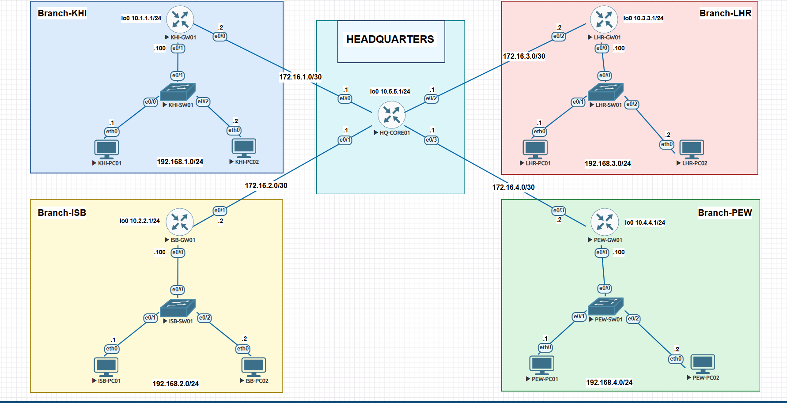
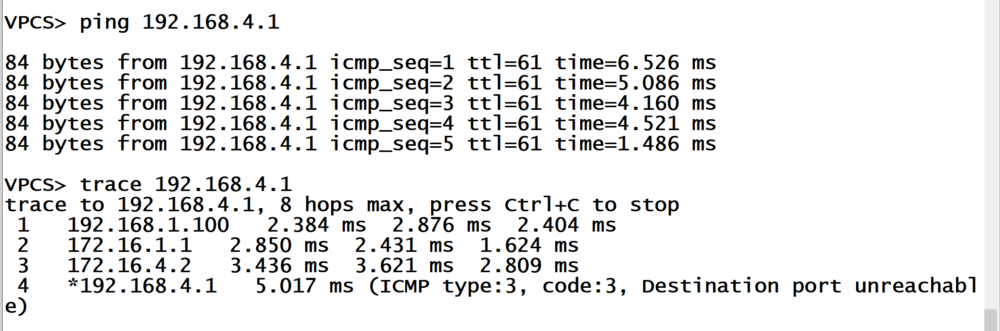
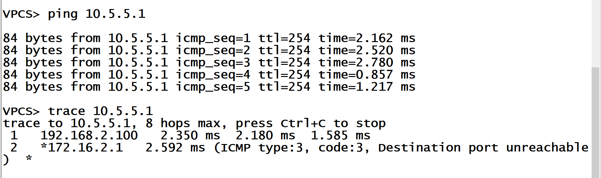

# Cisco IOS Default Routing Lab: Hub & Spoke Enterprise Network

This lab demonstrates how to configure **Default Routing** across a 4-branch corporate network (**Karachi**, **Islamabad**, **Lahore**, and **Peshawar**) connected to a central headquarters router (**HQ-CORE01**). 

The main goal of this project is to simplify routing for branch networks. Instead of manually adding every single remote network route to the branch routers, each branch router uses a single **default route** (`0.0.0.0 0.0.0.0`) pointing to HQ. The central HQ core router then uses static routes to direct traffic to the correct branch.

---

## Network Topology

### Topology Overview
* **5 Routers:** 1 Central Core Router (`HQ-CORE01`) and 4 Branch Gateways (`KHI-GW01`, `ISB-GW01`, `LHR-GW01`, `PEW-GW01`)
* **4 Switches:** Layer 2 switches (`KHI-SW01`, `ISB-SW01`, `LHR-SW01`, `PEW-SW01`)
* **8 Host PCs:** 2 PCs per branch network (`PC01` and `PC02`)
* **4 WAN Links:** `/30` point-to-point connections between HQ and each branch
* **4 Branch LANs:** `/24` subnets for host computers
* **5 Loopback Interfaces:** `/24` subnets simulating internal router networks

---

## IP Addressing Tables

### 1. WAN Links (Router-to-Router /30 Subnets)

| Link Subnet | Device A | Device A IP | Device B | Device B IP |
| :--- | :--- | :--- | :--- | :--- |
| `172.16.1.0/30` | HQ-CORE01 (e0/0) | 172.16.1.1 | KHI-GW01 (e0/0) | 172.16.1.2 |
| `172.16.2.0/30` | HQ-CORE01 (e0/1) | 172.16.2.1 | ISB-GW01 (e0/1) | 172.16.2.2 |
| `172.16.3.0/30` | HQ-CORE01 (e0/2) | 172.16.3.1 | LHR-GW01 (e0/2) | 172.16.3.2 |
| `172.16.4.0/30` | HQ-CORE01 (e0/3) | 172.16.4.1 | PEW-GW01 (e0/3) | 172.16.4.2 |

### 2. Branch LAN Networks (/24 Subnets)

| Host Device | Branch Location | Host Interface | Host IP | Gateway IP (Interface) | Subnet |
| :--- | :--- | :--- | :--- | :--- | :--- |
| **KHI-PC01** | Karachi | eth0 | 192.168.1.1 | 192.168.1.100 (e0/1) | `192.168.1.0/24` |
| **KHI-PC02** | Karachi | eth0 | 192.168.1.2 | 192.168.1.100 (e0/1) | `192.168.1.0/24` |
| **ISB-PC01** | Islamabad | eth0 | 192.168.2.1 | 192.168.2.100 (e0/0) | `192.168.2.0/24` |
| **ISB-PC02** | Islamabad | eth0 | 192.168.2.2 | 192.168.2.100 (e0/0) | `192.168.2.0/24` |
| **LHR-PC01** | Lahore | eth0 | 192.168.3.1 | 192.168.3.100 (e0/0) | `192.168.3.0/24` |
| **LHR-PC02** | Lahore | eth0 | 192.168.3.2 | 192.168.3.100 (e0/0) | `192.168.3.0/24` |
| **PEW-PC01** | Peshawar | eth0 | 192.168.4.1 | 192.168.4.100 (e0/0) | `192.168.4.0/24` |
| **PEW-PC02** | Peshawar | eth0 | 192.168.4.2 | 192.168.4.100 (e0/0) | `192.168.4.0/24` |

### 3. Router Loopback Interfaces (/24 Subnets)

| Device | Interface | IP Address & Mask | Description |
| :--- | :--- | :--- | :--- |
| **KHI-GW01** | Loopback0 | `10.1.1.1 255.255.255.0` | Karachi Internal Subnet |
| **ISB-GW01** | Loopback0 | `10.2.2.1 255.255.255.0` | Islamabad Internal Subnet |
| **LHR-GW01** | Loopback0 | `10.3.3.1 255.255.255.0` | Lahore Internal Subnet |
| **PEW-GW01** | Loopback0 | `10.4.4.1 255.255.255.0` | Peshawar Internal Subnet |
| **HQ-CORE01** | Loopback0 | `10.5.5.1 255.255.255.0` | Central HQ Loopback Subnet |

---

## What I Learned & Key Concepts

### 1. Default Routing (`0.0.0.0 0.0.0.0`)
A default route acts as a **"catch-all" path**. Since each branch router has only one connection leading outside (towards HQ), it doesn't need to know every individual remote network. Any packet destined for an outside location is automatically forwarded to HQ using the default route command (`ip route 0.0.0.0 0.0.0.0 <HQ-NEXT-HOP-IP>`).

### 2. Hub-and-Spoke Topology
In a Hub-and-Spoke setup, all branch sites ("spokes") connect to a single central headquarters ("hub"). If Karachi wants to send data to Peshawar, the traffic travels first to `HQ-CORE01`, which then routes it to Peshawar.

### 3. Central Core Static Routing
Because HQ connects directly to all four branch gateways, `HQ-CORE01` must know how to deliver incoming traffic back to each location. It uses **Static Routes** pointing to each branch router's WAN IP for LAN networks (`192.168.x.0/24`) and loopback networks (`10.x.x.0/24`).

### 4. Efficient Subnetting (`/30` Masks)
Point-to-point links between routers only require 2 usable IP addresses (one for each side). A `/30` subnet mask (`255.255.255.252`) provides exactly 2 usable IP addresses, preventing waste of IPv4 addresses.

### 5. Easy Scalability
Default routing keeps branch routing tables small and simple. If HQ adds a new server or another branch in the future, the existing branch routers do not need any new static routes—their default route automatically sends non-local traffic to HQ.

---

## Verification & Testing

### 1. Branch-to-Branch Communication (KHI to PEW)
Ping and traceroute test from Karachi (`KHI-PC01`) to Peshawar (`PEW-PC01`) passing through `HQ-CORE01`:

### 2. Branch to HQ Loopback Verification
Ping and traceroute test from Islamabad (`ISB-PC01`) to reach HQ Core Router loopback (`10.5.5.1`):

---

## Device Configuration Files

Full running configurations for all devices can be found in the `configs/` folder:
* [HQ-CORE01 Config](configs/HQ-CORE01.txt)
* [KHI-GW01 Config](configs/KHI-GW01.txt)
* [ISB-GW01 Config](configs/ISB-GW01.txt)
* [LHR-GW01 Config](configs/LHR-GW01.txt)
* [PEW-GW01 Config](configs/PEW-GW01.txt)