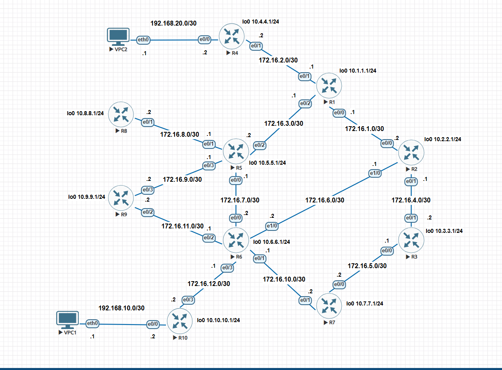
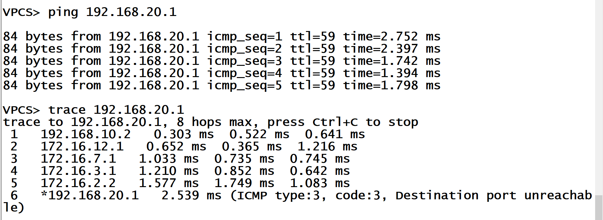

# Cisco IOS Static Routing Lab

This lab demonstrates manual static routing across a 10-router Cisco network topology. The goal of the project is to achieve full end-to-end reachability between edge devices, optimize routing tables using default routes on stub routers, and implement load balancing across redundant paths.

---

## Network Topology



The topology includes:
* **10 Cisco Routers** (R1 through R10)
* **2 Host Virtual PCs** (VPC1 and VPC2)
* **12 Point-to-Point Transit Links** (`/30` subnets)
* **10 Router Loopback Interfaces** (`/24` subnets acting as simulated LANs)

---

## IP Addressing Tables

### 1. Inter-Router Transit Links (/30)

| Subnet | Device A (Interface) | Device A IP | Device B (Interface) | Device B IP |
| :--- | :--- | :--- | :--- | :--- |
| `172.16.1.0/30` | R1 (e0/0) | 172.16.1.1 | R2 (e0/0) | 172.16.1.2 |
| `172.16.2.0/30` | R1 (e0/1) | 172.16.2.1 | R4 (e0/1) | 172.16.2.2 |
| `172.16.3.0/30` | R1 (e0/2) | 172.16.3.1 | R5 (e0/2) | 172.16.3.2 |
| `172.16.4.0/30` | R2 (e0/1) | 172.16.4.1 | R3 (e0/1) | 172.16.4.2 |
| `172.16.5.0/30` | R3 (e0/0) | 172.16.5.1 | R7 (e0/0) | 172.16.5.2 |
| `172.16.6.0/30` | R2 (e1/0) | 172.16.6.1 | R6 (e1/0) | 172.16.6.2 |
| `172.16.7.0/30` | R5 (e0/0) | 172.16.7.1 | R6 (e0/0) | 172.16.7.2 |
| `172.16.8.0/30` | R5 (e0/1) | 172.16.8.1 | R8 (e0/1) | 172.16.8.2 |
| `172.16.9.0/30` | R5 (e0/3) | 172.16.9.1 | R9 (e0/3) | 172.16.9.2 |
| `172.16.10.0/30` | R6 (e0/1) | 172.16.10.1 | R7 (e0/1) | 172.16.10.2 |
| `172.16.11.0/30` | R6 (e0/2) | 172.16.11.1 | R9 (e0/2) | 172.16.11.2 |
| `172.16.12.0/30` | R6 (e0/3) | 172.16.12.1 | R10 (e0/3) | 172.16.12.2 |

### 2. End-User Host Networks (/30)

| Host Device | Gateway Router | Interface | Host IP | Gateway IP | Subnet |
| :--- | :--- | :--- | :--- | :--- | :--- |
| **VPC1** | R10 | e0/0 | 192.168.10.1 | 192.168.10.2 | `192.168.10.0/30` |
| **VPC2** | R4 | e0/0 | 192.168.20.1 | 192.168.20.2 | `192.168.20.0/30` |

### 3. Loopback Interfaces (/24)

| Device | Interface | IP Address / Subnet Mask | Description |
| :--- | :--- | :--- | :--- |
| **R1** | Loopback0 | `10.1.1.1 255.255.255.0` | Simulated Local Subnet |
| **R2** | Loopback0 | `10.2.2.1 255.255.255.0` | Simulated Local Subnet |
| **R3** | Loopback0 | `10.3.3.1 255.255.255.0` | Simulated Local Subnet |
| **R4** | Loopback0 | `10.4.4.1 255.255.255.0` | Simulated Local Subnet |
| **R5** | Loopback0 | `10.5.5.1 255.255.255.0` | Simulated Local Subnet |
| **R6** | Loopback0 | `10.6.6.1 255.255.255.0` | Simulated Local Subnet |
| **R7** | Loopback0 | `10.7.7.1 255.255.255.0` | Simulated Local Subnet |
| **R8** | Loopback0 | `10.8.8.1 255.255.255.0` | Simulated Local Subnet |
| **R9** | Loopback0 | `10.9.9.1 255.255.255.0` | Simulated Local Subnet |
| **R10** | Loopback0 | `10.10.10.1 255.255.255.0` | Simulated Local Subnet |

---

## What I Learned & Key Concepts

### 1. Hop-by-Hop Routing
Routers do not view the full end-to-end topology at once. Every router makes forwarding decisions individually by checking its own local routing table (`show ip route`) for a matching next-hop IP address.

### 2. Two-Way Reachability
A connection is only successful if both the outbound path to the destination and the return path back to the sender exist. If any intermediate router lacks a route back to the source IP, the ping fails even if the request reached its target.

### 3. Default Routes on Stub Routers
A stub router has only one connection to the rest of the network. Routers R4, R8, and R10 use a single default static route (`ip route 0.0.0.0 0.0.0.0 <next-hop>`) instead of listing every individual network, keeping their routing tables small and efficient.

### 4. Equal-Cost Multi-Path (ECMP) Load Balancing
Router R9 connects to two neighbors (R5 and R6). By adding two default routes with equal cost:
```text
ip route 0.0.0.0 0.0.0.0 172.16.9.1
ip route 0.0.0.0 0.0.0.0 172.16.11.1
```
R9 automatically splits outbound traffic across both paths and provides automatic failover if one link goes down.

### 5. Loopbacks as Simulated LANs
Using `/24` subnet masks (`255.255.255.0`) on virtual loopback interfaces allows each router to simulate a full network of 254 potential hosts without adding physical switches or PCs.

---

## Verification & Path Analysis

### VPC1 to VPC2
End-to-end ICMP reachability test and hop-by-hop traceroute path analysis executed from VPC1 to VPC2:



### R1 to R10 Remote Loopback
ICMP echo verification executed from R1 to reach R10's remote loopback interface (`10.10.10.1`):


---

## Router Configuration Files

Full running configurations for all devices can be found in the `configs/` folder:
* [R1 Config](configs/R1.txt)
* [R2 Config](configs/R2.txt)
* [R3 Config](configs/R3.txt)
* [R4 Config](configs/R4.txt)
* [R5 Config](configs/R5.txt)
* [R6 Config](configs/R6.txt)
* [R7 Config](configs/R7.txt)
* [R8 Config](configs/R8.txt)
* [R9 Config](configs/R9.txt)
* [R10 Config](configs/R10.txt)