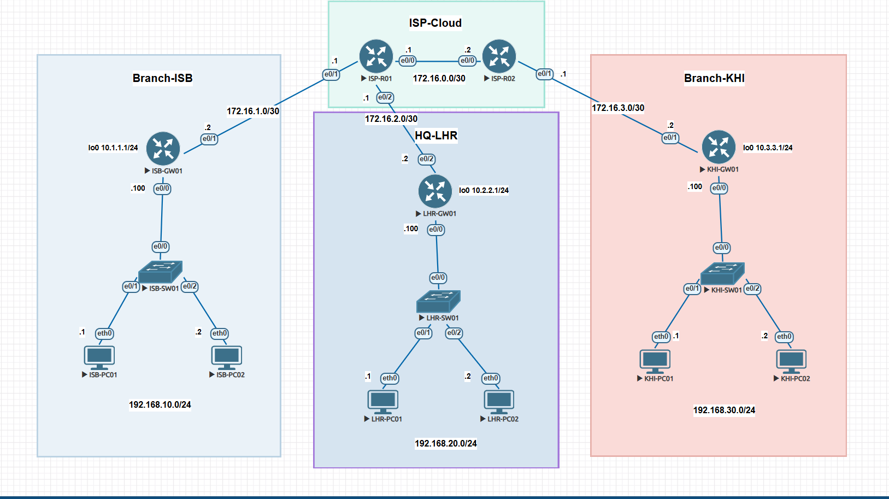
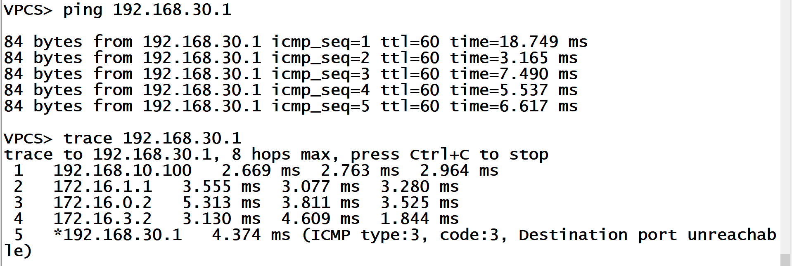
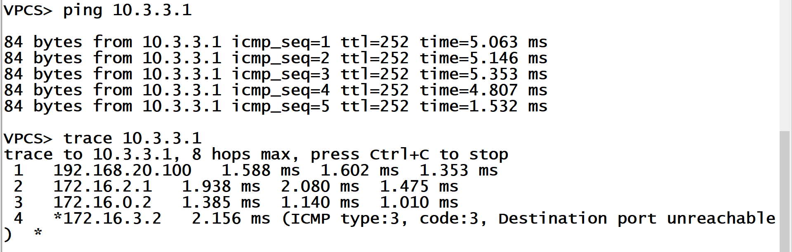

# Cisco IOS Static Routing Lab 2: Enterprise WAN & ISP Transit Cloud

This lab demonstrates static routing architecture across a 3-branch corporate enterprise network (**Islamabad**, **Lahore HQ**, and **Karachi**) interconnected via a simulated **ISP Cloud WAN infrastructure**. The goal of the project is to achieve full multi-site end-to-end reachability using default routes on edge gateways, efficient `/30` point-to-point transit links, and core static transit routing across provider routers.

---

## Network Topology

The topology includes:
* **5 Cisco Routers** (3 Branch Gateways: `ISB-GW01`, `LHR-GW01`, `KHI-GW01` & 2 ISP Core Routers: `ISP-R01`, `ISP-R02`)
* **3 Cisco Layer 2 Switches** (`ISB-SW01`, `LHR-SW01`, `KHI-SW01`)
* **6 Host Virtual PCs** (2 per branch: `PC01` and `PC02`)
* **4 Point-to-Point WAN Links** (`/30` subnets)
* **3 Branch Local Area Networks** (`/24` subnets)
* **3 Gateway Loopback Interfaces** (`/24` subnets acting as simulated internal networks)

---

## IP Addressing Tables

### 1. Inter-Router WAN Transit Links (/30)

| Subnet | Device A (Interface) | Device A IP | Device B (Interface) | Device B IP |
| :--- | :--- | :--- | :--- | :--- |
| `172.16.1.0/30` | ISP-R01 (e0/1) | 172.16.1.1 | ISB-GW01 (e0/1) | 172.16.1.2 |
| `172.16.2.0/30` | ISP-R01 (e0/2) | 172.16.2.1 | LHR-GW01 (e0/2) | 172.16.2.2 |
| `172.16.3.0/30` | ISP-R02 (e0/1) | 172.16.3.1 | KHI-GW01 (e0/1) | 172.16.3.2 |
| `172.16.0.0/30` | ISP-R01 (e0/0) | 172.16.0.1 | ISP-R02 (e0/0) | 172.16.0.2 |

### 2. End-User Host Networks (/24)

| Host Device | Department / Branch | Host Interface | Host IP | Gateway IP (Interface) | Subnet |
| :--- | :--- | :--- | :--- | :--- | :--- |
| **ISB-PC01** | Branch ISB | eth0 | 192.168.10.1 | 192.168.10.100 (e0/0) | `192.168.10.0/24` |
| **ISB-PC02** | Branch ISB | eth0 | 192.168.10.2 | 192.168.10.100 (e0/0) | `192.168.10.0/24` |
| **LHR-PC01** | HQ LHR | eth0 | 192.168.20.1 | 192.168.20.100 (e0/0) | `192.168.20.0/24` |
| **LHR-PC02** | HQ LHR | eth0 | 192.168.20.2 | 192.168.20.100 (e0/0) | `192.168.20.0/24` |
| **KHI-PC01** | Branch KHI | eth0 | 192.168.30.1 | 192.168.30.100 (e0/0) | `192.168.30.0/24` |
| **KHI-PC02** | Branch KHI | eth0 | 192.168.30.2 | 192.168.30.100 (e0/0) | `192.168.30.0/24` |

### 3. Loopback Interfaces (/24)

| Device | Interface | IP Address / Subnet Mask | Description |
| :--- | :--- | :--- | :--- |
| **ISB-GW01** | Loopback0 | `10.1.1.1 255.255.255.0` | Simulated Internal Subnet |
| **LHR-GW01** | Loopback0 | `10.2.2.1 255.255.255.0` | Simulated Internal Subnet |
| **KHI-GW01** | Loopback0 | `10.3.3.1 255.255.255.0` | Simulated Internal Subnet |

---

## What I Learned & Key Concepts

### 1. Edge Gateway Functionality
Edge gateways sit at the perimeter of each branch network, connecting private local networks (LANs) to external service provider links (WANs). They serve as the single entry and exit point for all traffic leaving or entering the branch.

### 2. Simulated ISP WAN Infrastructure
Using a central ISP cloud models real-world enterprise WAN connectivity. It separates local branch network operations from service provider core routing, allowing geographically separated branches to communicate across long distances.

### 3. Default Routes on Branch Gateways
Because each branch gateway has only one path to the external network, individual static routes for every remote subnet are unnecessary. A single **Default Static Route** (`ip route 0.0.0.0 0.0.0.0 <ISP-IP>`) handles all outbound traffic leaving the branch.

### 4. Core Transit Static Routing
While branch gateways only need a single default route pointing to the ISP, the intermediate ISP routers (`ISP-R01` and `ISP-R02`) require specific static routes for every branch subnet (`192.168.10.0/24`, `192.168.20.0/24`, `192.168.30.0/24`) and loopback range to route cross-branch traffic correctly.

### 5. Point-to-Point WAN Subnetting (`/30`)
Using `/30` subnet masks (`255.255.255.252`) on router-to-router connections allocates exactly two usable host IP addresses per link. This conserves IPv4 address space and eliminates IP waste across point-to-point WAN links.

### 6. Layer 2 Switching and Layer 3 Routing Interaction
Layer 2 switches operate transparently using MAC address tables to deliver Ethernet frames locally within a branch. Routers operate at Layer 3 to determine remote destination paths using routing tables and use ARP to resolve local host MAC addresses.

---

## Verification & Path Analysis

### ISB-PC01 to KHI-PC01
End-to-end ICMP reachability test and hop-by-hop traceroute path analysis executed from Islamabad host (`ISB-PC01`) across the ISP cloud to Karachi host (`KHI-PC01`):

### LHR-PC01 to KHI-GW01 Remote Loopback
ICMP echo verification executed from `LHR-PC01` to reach Karachi Gateway's remote loopback interface (`10.3.3.1`):

---

## Router Configuration Files

Full running configurations for all devices can be found in the `configs/` folder:
* [ISB-GW01 Config](configs/ISB-GW01.txt)
* [LHR-GW01 Config](configs/LHR-GW01.txt)
* [KHI-GW01 Config](configs/KHI-GW01.txt)
* [ISP-R01 Config](configs/ISP-R01.txt)
* [ISP-R02 Config](configs/ISP-R02.txt)